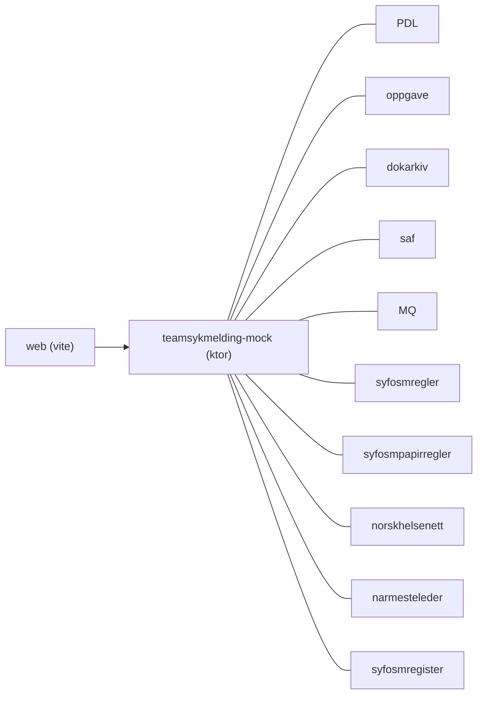

# teamsykmelding-mock

This application generates synthetic test data within the domain of teamsykmelding

## Technologies used

Backend:

* Kotlin
* Ktor
* Gradle
* Junit
* MQ

Frontend:

* React
* Vite

#### Requirements

* JDK 21
* Node 20

## FlowChart

This the high level flow of the application



## Getting started

### Pre-requisites

Install these using mise/asdf or any other package manager (**not** brew)

- JDK 21
- Node 20

Enable corepack:

``` shell
corepack enable
```

### Running the application

#### Run the backend

For local development the application runs in two parts, the ktor app and the vite development server. The Ktor-app is
best to run in IntelliJ so you can do partial builds and get hot swapping.

Go to Application.kt and run the main function, edit the run-configuration in IntelliJ and add the following "VM
Option":

```plain
-Dio.ktor.development=true
```

You can now use this to run the application in development mode. Using the "build" feature in IntelliJ on a single file
will (usually) hot-swap it without requiring a full server reboot when developing.

#### Run the frontend

While the backend is running, cd into the web folder and run the following commands:

``` shell
yarn
```

``` shell
yarn dev
```

You will now have a development server on http://localhost:5173 that uses the Ktor-backend. You're not ready to develop
new mock features!

Note: Vite automatically hot-reloads.

#### Build and run tests

To build locally and run the integration tests you can simply run

``` bash
./gradlew shadowJar
```

or on windows
`gradlew.bat shadowJar`

Creating a docker image should be as simple as

``` shell
docker build -t macgyver .
```

#### :floppy_disk: Running a docker image

``` shell
docker run --rm -it -p 8080:8080 macgyver
```

### Upgrading the gradle wrapper

Find the newest version of gradle here: https://gradle.org/releases/ Then run this command:

``` bash 
./gradlew wrapper --gradle-version $gradleVersjon
```

### Swagger api doc

The Swagger api doc is available here
https://teamsykmelding-mock.ansatt.dev.nav.no/docs

### Contact

This project is maintained by [navikt/teamsykmelding](CODEOWNERS)

Questions and/or feature requests? Please create an
[issue](https://github.com/navikt/teamsykmelding-mock/issues)

If you work in [@navikt](https://github.com/navikt) you can reach us at the Slack
channel [#team-sykmelding](https://nav-it.slack.com/archives/CMA3XV997)
